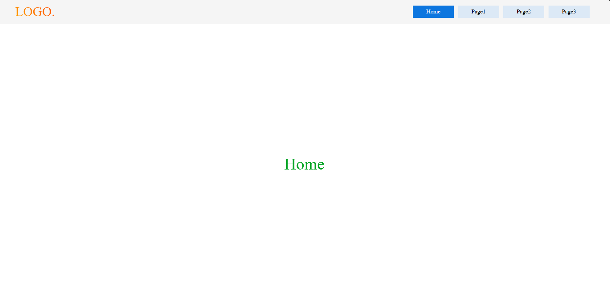
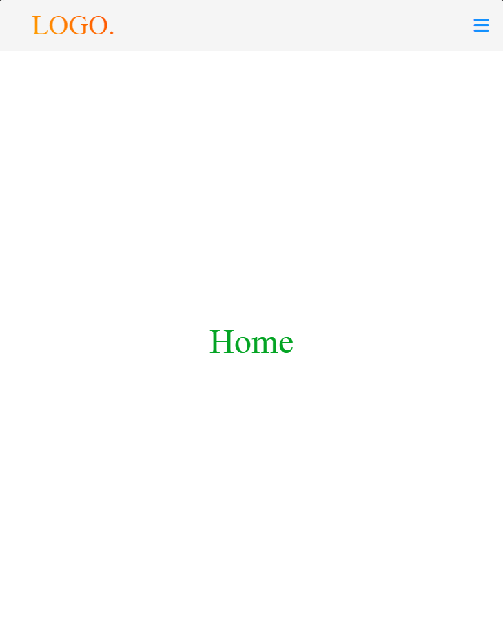
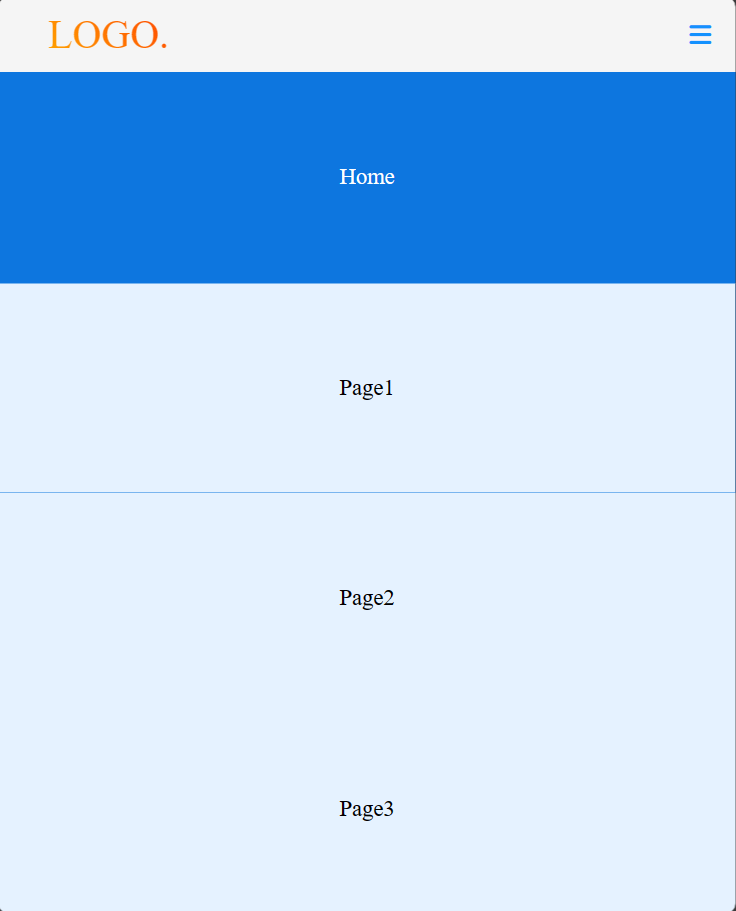

# Responsive Navbar

Optimize your website for all platforms.In this project, a simple responsive navbar example is made.Navbar is indispensable for websites.Mobilize your website.


## Javascript Code Example

```javascript
res_bar.addEventListener('click',() => {
    //open
    if(menu.style.visibility != 'visible'){
        menu.style.visibility = 'visible';
        menu.style.height = 'calc(100vh - 60px)';
        menu.style.opacity = '1';
    }
    //close
    else close_menu()
})
```



<center></center>
<center></center>


  
